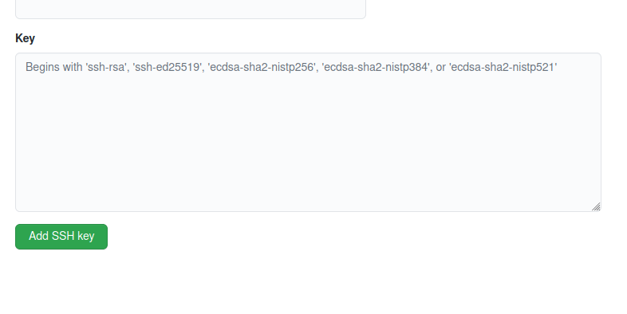

# Github SSH key Setup

### Requirements

1. Surely a github account :nerd_face:
2. A Mac/Linux/Windows or Android devices (Yes, I once had my Android device setup for pushing little changes when I couldn't get my PC) :grin:
3. Internet Connection :relieved:
4. Little knowledge of the Terminal (Command Line) :yum:

As Kanye West said:

> We're living the future so
> the present is our past.

```
Alright Let's Go
```

## Step One : Checking For Existing SSH Keys

## _Linux, Mac & Windows(Git Bash)_

First, we're gonna check if there's an existing SSH key on your device.
NOTE: If you're sure you don't have existing SSH keys you can skip this step to the next one.

Open Terminal

    Ctrl + Alt + T

Enter the following command to see if existing SSH keys are present

> ls -al ~/.ssh

It'll list the files in this directory if they exist.
If a count instead is shown or no files you can move to step two

Expected Output

    id_rsa.pub
    id_ecdsa.pub
    id_ed25519.pub

If you already have and wish to use then, skip step 2 and continue from step 3. But if you wish to not use any already available to connect to github you can continue with step 2.

## Step 2: Generating SSH Keys

## _Linux, Mac & Windows(Git Bash)_

Type or paste the command below intor your terminal, replace your_email@example.com with your Github email address.

> ssh-keygen -t rsa -b 4096 -C "your_email@example.com"

Press "Enter" when prompted "Enter a file in which to save the key".
Doing this accepts the default location.

    > Enter a file in which to save the key(/home/you/.ssh/id_rsa):[Press Enter]

At the next prompt type a secure password and confirm it by typing it again on the next prompt

    > Enter passphrase (empty for no passphrase): [Type a passphrase]
    > Enter same passphrase again: [Type passphrase again]

## Step 3 Adding SSH key to the ssh-agent

## _Linux & Windows(Git Bash)_

Start the ssh-agent in the background

> eval "\$(ssh-agent -s)"

Result: But could be a different number

     Agent pid 67068

Add your ssh private key to the ssh-agent.

> ssh-add ~/.ssh/id_rsa

## _Mac_

Start the ssh-agent in the background

> eval "\$(ssh-agent -s)"

Result: But could be a different number

     Agent pid 59068

NOTE: For macOS Sierra 10.12.2 or later
Modify your ([~/.ssh/config]()) file to automatically load keys into the ssh-agent and store passphrases in your keychain.

1. First check to see if your [~/.ssh/config]() file exists in the default location

> open ~/.ssh/config

If you get

    [The file /Users/you/.ssh/config does not exist

Then create the file.

> touch ~/.ssh/config

Open it and modify the file.

    Host *
        AddKeysToAgent yes
        UseKeyChain yes
        IdentityFile ~/.ssh/id_rsa

Add your ssh private key to the ssh-agent.

> ssh-add ~/.ssh/id_rsa

If for professional purposes or personal purposes, you created the key with a different name, replace id_rsa with the name of the private key file.

## Step 4: Adding SSH key to your Github Account

Copy the SSH key to your clipboard
REMINDER: If your SSH key file has a different name, modify the filename to match your setup. No new line or whitespace are allowed.

## _MAC_

> pbcopy < ~/.ssh/id_rsa.pub

## _Linux_

To Check for latest drivers and update

> sudo apt-get update

> sudo apt-get upgrade -y

Install xclip and copy the contents

> sudo apt-get install xclip

> xclip -sel clip < ~/.ssh/id_rsa.pub

## _Windows_

> clip < ~/.ssh/id_rsa.pub

# General

> ALL COMMANDS ARE DONE NOW.

## Login your Github on a browser

## Navigate to Settings


## Select SSH and GPG keys


## Click New SSH keys


## In the Title field, add a descriptive label for the new key


## Finally paste your key into the Key Field and click add



### Now you can go back to your terminal and clone, push, pull and run every other Git command without having to repeatedly input your GITHUB details

### Extra Note: When try to perform a Git command from an Editors or IDE for the first time, you might be asked to input the passphrase use in creating the SSH key.

### You can either allow it once or allow it until you choose to remove the SSH Key from Github
